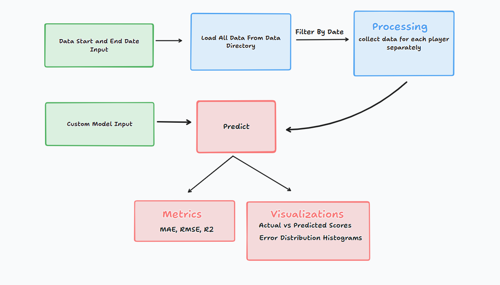
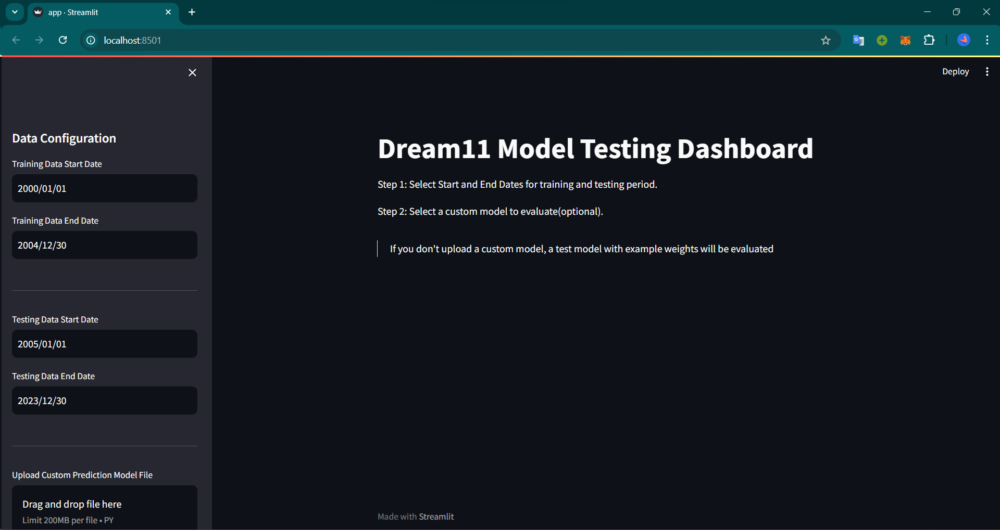
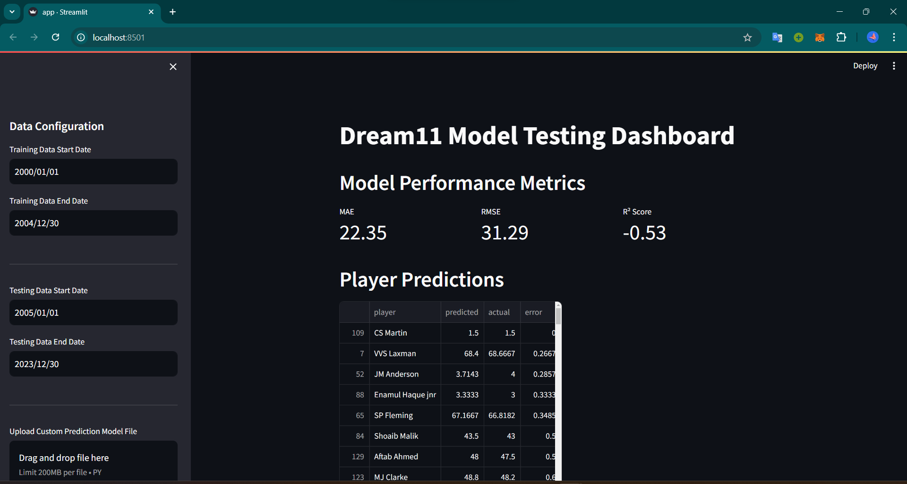
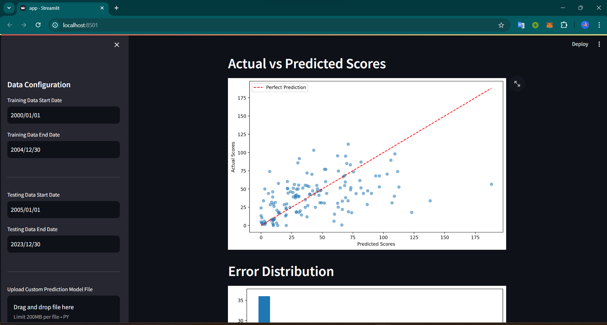

# Task 2: Dream11 Model Evaluation Dashboard in Streamlit
This project is a Cricket Prediction Dashboard built with Streamlit to help users analyze and evaluate cricket player performance models. It supports uploading custom prediction models, processing historical cricket data, and visualizing prediction accuracy. It’s designed for building fantasy cricket teams (like Dream11) who want to predict player performance and evaluate different model strategies.


## Features
- **Custom Model Upload:** Upload custom Python prediction models, or test directly using example weights
- **Data Processing:** Works readily with cricsheet JSON data, loaded separately for test and train part based on start and end date. 
- **Performance Metrics:** Measure the performance of models using MAE, RMSE, and R² Score.
- **Interactive Dashboard:** Explore player prediction accuracy, error distributions, and actual vs. predicted scores.


## Installation
Clone this repository:

```bash
git clone https://github.com/your-username/dream11-model-dashboard.git
cd dream11-model-dashboard
```
Install dependencies:

```bash
pip install -r requirements.txt
```
## Usage
To start the dashboard, run the following command:

```bash
streamlit run app.py
```
> ### Note:
> - If you don't upload a model from the sidebar configuration, it will still work, but with example weights of 0.5 for each feature.
> - Currently the data folder contains only a subset of data for faster testing. To use the complete data download JSON data from [Cricsheet](https://cricsheet.org/downloads/) and save it in the `data` folder.
> You can test custom models using `example_models/linear_reg.py` model given.

### Screenshots




### ToDo
- Currently the metrics work by predicting runs for each player, It needs to be changed to calculating fantasy points for each player based on the prediction.